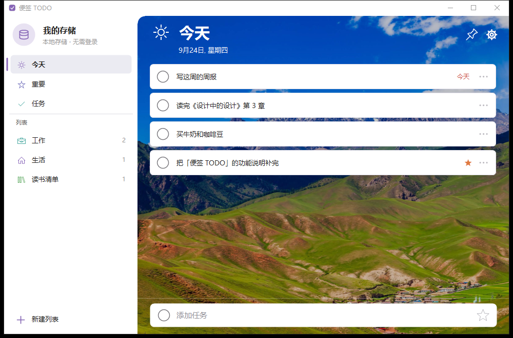
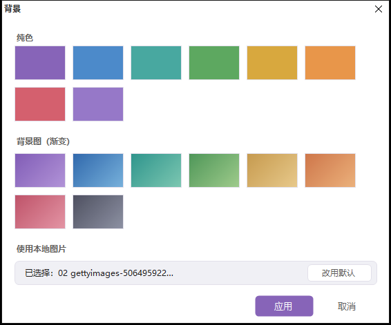
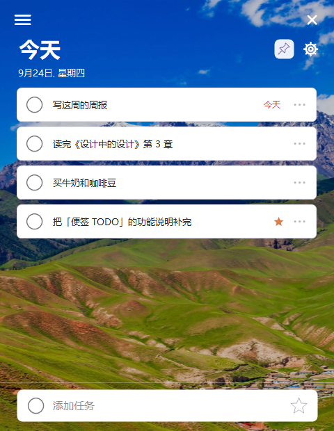
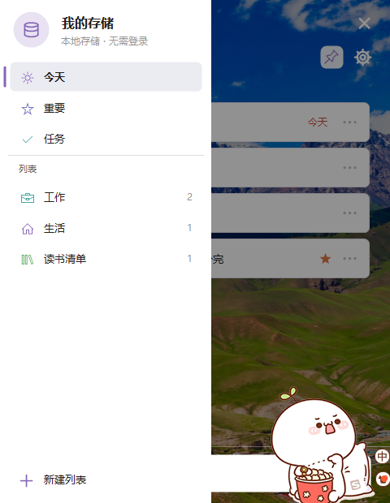

# 我写了一个 100KB 的本地待办小工具：仿微软 To Do 的「便签 TODO」

> 单文件 exe、零第三方依赖、纯本地存储、不联网不要账号。界面照着微软 To Do 做了一遍，还顺手做了「钉住小窗」模式。



## 一、为什么又造一个待办轮子

起因很具体：我想要的只是一个**躺在托盘里、随手记一条、不联网、不要账号**的小工具，但试过的方案总有一样不称心——要么得登录同步，要么 Electron 一装 200MB 起步，要么把数据塞进某个云端数据库。

于是给自己定了三条硬约束：

1. **单文件运行**：一个 exe 双击就能用，不装运行时、不拖一堆 DLL；
2. **数据在自己机器上**：一个 JSON 文件，想看就看，想备份就备份，删软件不残留；
3. **像 Windows 自带应用**：界面照着微软 To Do 的样子来，鼠标不用重新学。

结果就是一个 **105 KB 的 exe**（对，比一张截图还小），用 .NET Framework 4.8 + WinForms 手写全部自绘界面。

## 二、功能一览

### 1. 三个内置视图 + 自定义列表

左边栏是熟悉的结构：**今天 / 重要 / 任务**三个内置视图，下面是自己建的列表。

- **今天**：标题下显示今天的日期；任何入口新加的任务都会记上时间并标为「今天」，所以不管在哪个列表里加的，都能在今天这一栏看到（跨天后自动离开）；
- **重要**：所有打了星标的任务汇总；
- **任务**：全部任务，按「未完成 / 已完成」两组展示；
- 列表可以自定义**图标（30 个）、颜色、背景**，也能全部删光（删完不会偷偷补一个列表回来）。

### 2. 全部版块都能单独换背景

每个视图、每个列表都有自己的背景：**纯色（8 色）/ 渐变（8 组）/ 本地图片**。图片背景会自动铺满并轻雾处理，保证文字可读。



背景面板是**按下即生效**的——鼠标一按下色块，后面的主窗口立刻就变，看着满意再点「应用」，不满意点「取消」原样还原。

### 3. 钉住小窗（我最常用的模式）

点右上角那个📌钉子，主窗口收起成一条 480px 宽的小窗：

- **隐藏标题栏**、尺寸锁死、**永远置顶**；
- 顶部一行是 ☰ 和关闭按钮，**按住这一行还能拖着窗口走**；
- 点 ☰ 会从左侧**滑出完整侧栏**（导航 + 列表 + 新建列表），同时把右边内容压一层遮罩，点遮罩或选完视图就收回。




写东西的时候把它钉在屏幕右上角，看一眼就知道今天还剩什么，不抢焦点也不挡事。

### 4. 添加任务：一个白色圆角输入条

底部那条**和任务行同宽**的白色圆角输入条，左侧一个圆圈（就是任务行的勾选框样式），最右侧一颗星：**点亮它，新加的任务直接带「重要」标记**。

- 点一下或 `Ctrl+N` 进入输入，聚焦后整条都是输入区（全高度），不会出现「窄窄一条」的尴尬；
- `Enter` 保存并连续添加，`Esc` 取消；
- 点星星不会丢掉已输入的文字，焦点会留在输入框继续打字。

### 5. 拖拽进来就能用

从别的窗口**拖文本 / 图片 / 文件**到主界面上：

| 拖进来的东西 | 效果 |
|---|---|
| 文本（网页选中的文字、编辑器内容） | 自动打开输入条并追加进去，回车即保存 |
| 图片（图片文件，或从浏览器直接拖的图） | 存一份到数据目录，**立刻变成当前版块的背景** |
| 其它文件 / 快捷方式 | 按文件名拼成任务标题 |

### 6. 托盘、单实例、开机自启

- 关闭窗口 = 收进托盘（可在设置里改成直接退出）；托盘图标角标显示未完成数；
- 托盘右键菜单可以直接切到 今天 / 重要 / 任务；
- 重复启动不会开第二个进程，只把已有窗口调到前台；
- 可设置开机自启、置顶、不透明度。

## 三、一些细节上的取舍

**图标为什么不是 emoji。** 一开始图标是 emoji 字符，想着能"自带颜色"挺好看。实测下来：Windows 10 的 emoji 字体里只有 COLR/CPAL 分层矢量，GDI/GDI+（包括 Label、RichTextBox、原生 RichEdit 控件）全都只能画出**单色**字形，真要彩色得引 Direct2D + DirectWrite 互操作。最后改用 **Windows 自带的 Segoe MDL2 Assets**（微软 To Do 用的同一套图标字体）：单色轮廓干净、颜色完全可控、零外部素材，exe 还是一个文件。

**图标和文字的对齐。** GDI+ 画字形默认按「行盒」居中，MDL2 的墨迹偏上行盒，图标看着就比文字高一截。改成先量出**字形墨迹范围**，再把墨迹中心对准矩形中心；文字那边因为走 TextRenderer 也是按行盒居中，中文墨迹比行盒中心低约 2px，所以同一行的图标再下移 2px。实测三者墨迹中心完全重合。

**左上角的圆角。** 内容区只有左上角是圆的，用抗锯齿路径「挖角」而不是区域裁剪——裁剪没有抗锯齿，边缘会有锯齿。这里还踩过一个坑：GDI+ 开抗锯齿时，如果填充路径的边正好压在客户区第一行/第一列上，那一行只会被覆盖半个像素，看起来就是一条淡淡的"边框"；把路径外沿超出客户区 2px 就干净了。

**数据安全。** 每次改动都原子写盘（先写临时文件再替换）。JSON 万一损坏，会自动备份成 `.broken` 并重建。老版本的数据文件也能自动迁移。

## 四、技术实现

| 项 | 说明 |
|---|---|
| 运行环境 | .NET Framework 4.8（Windows 10/11 自带），WinForms + GDI+ 全自绘 |
| 编译 | `csc.exe` 直接编译，**不需要 Visual Studio、不需要 NuGet** |
| 依赖 | **零第三方依赖**，只用系统自带的类库和字体 |
| 产出 | 单个 `dist\StickyTodo.exe`（约 105 KB） |
| 数据 | `%APPDATA%\StickyTodo\todos.json`（UTF-8 JSON），点侧栏顶部「数据库图标」可直接打开这个目录 |
| 代码 | 10 个 .cs 文件，约 5000 行，中文注释 |
| 特色 | 单实例（Mutex + EventWaitHandle）、托盘 NotifyIcon、DPI 感知、圆角/渐变/图片背景全部自绘 |

编译方式（在项目目录执行）：

```powershell
# 普通编译
powershell -ExecutionPolicy Bypass -File .\build.ps1

# 先清空 dist 再编译
powershell -ExecutionPolicy Bypass -File .\build.ps1 -Clean
```

编译完直接双击 `dist\StickyTodo.exe` 就行。

## 五、快捷键

| 快捷键 | 作用 |
|---|---|
| `Ctrl+N` | 光标进添加任务框 |
| `Ctrl+I` | 切换重要标记（输入框开着时切换那颗星，否则切换选中的任务） |
| `Ctrl+M` | 切换窗体模式（收起小窗 / 恢复） |
| `Ctrl+P` | 换背景 |
| `Alt+1 / 2 / 3` | 切到 今天 / 重要 / 任务 |
| `Alt+~` | 小窗模式下 滑出 / 收起 侧栏菜单 |
| `Enter` | 保存并连续添加 |
| `Esc` | 取消输入 |
| `F2` | 改标题 |
| `Delete` | 删除选中项 |

## 六、已知限制与后面想做的

- 只支持 Windows（毕竟用了 WinForms 和系统字体）；
- 没有同步——这是刻意的，数据只在本机；
- 小窗模式下的侧栏是浮层，不能像主窗口那样常驻；
- 想让图标真正"自带颜色"，需要引 Direct2D/DirectWrite 来渲染彩色 emoji，暂时没做，改用 MDL2 单色图标了。

## 七、写在最后

这东西最初只是为了解决"随手记一条"的需求，写着写着把界面细节抠得比功能还细：圆角怎么画不锯齿、图标和文字怎么才真正居中对齐、小窗怎么拖着走……但用起来确实舒服——**一个 105 KB 的 exe，双击就有，数据永远在自己手里**。

如果你也想要一个不联网、不要账号、删掉不留痕的待办工具，可以照这个思路自己撸一个，比想象的简单。
